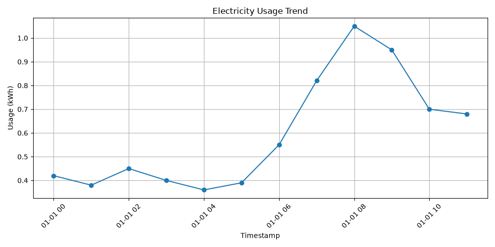
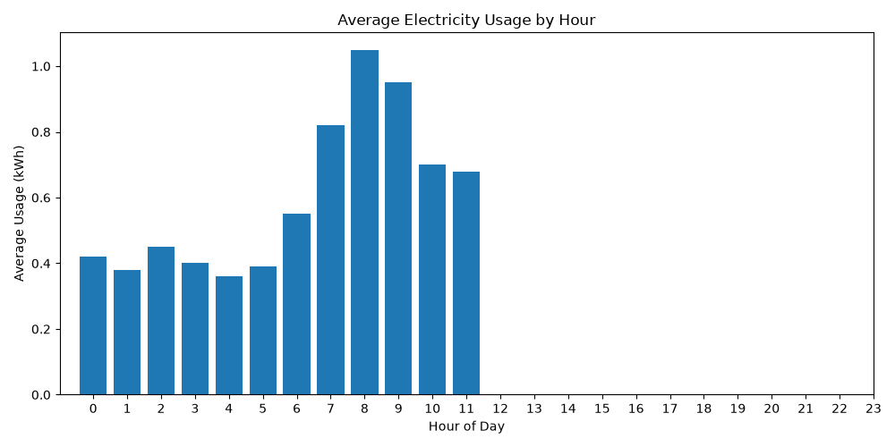
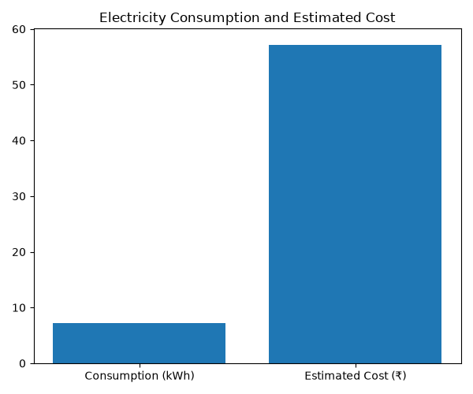
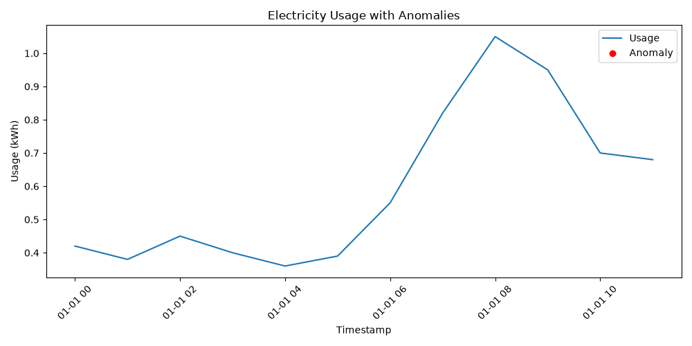
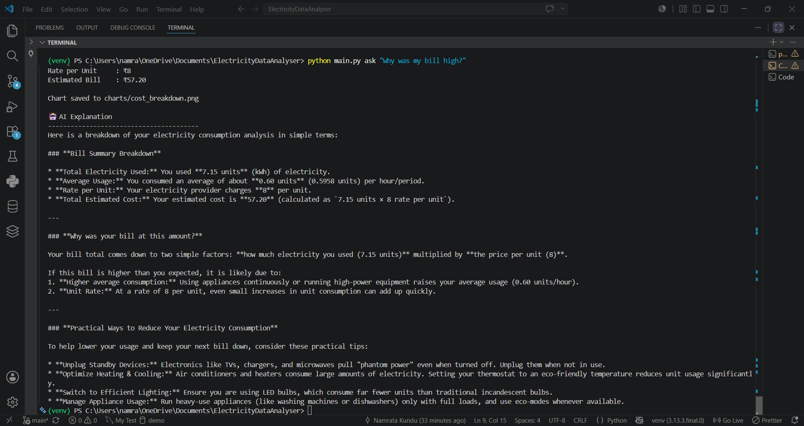

# ⚡ Electricity Data Analyzer

> A Python-based CLI application for analyzing electricity consumption using MySQL, Pandas, Matplotlib, and Google Gemini AI.


---

# 📖 Project Overview

Electricity Data Analyzer is a command-line application that transforms raw electricity usage data into meaningful insights.

Users can upload electricity consumption data from CSV files, store it in a MySQL database, analyze usage patterns, visualize trends, estimate electricity costs, detect anomalies, and receive AI-powered explanations using the Google Gemini API.

The project combines traditional data analytics with Generative AI to make electricity consumption reports easier to understand.

---

# ✨ Features

- Upload electricity usage data from CSV files
- Store data in MySQL
- Analyze electricity consumption trends
- Detect peak usage hours
- Estimate electricity bills
- Detect unusual consumption spikes
- Automatically generate charts
- AI-powered natural language explanations using Gemini
- Modular and scalable project architecture

---

# 🖥 Demo

## Load CSV

```bash
python main.py load data/sample_usage.csv
```

## Trend Analysis

```bash
python main.py trend
```

## Peak Hours

```bash
python main.py peak
```

## Cost Estimation

```bash
python main.py cost
```

## Detect Anomalies

```bash
python main.py anomalies
```

## Ask the AI Assistant

```bash
python main.py ask "Why was my electricity bill high?"
```

---

# 📷 Screenshots

## Trend Analysis



## Peak Usage Hours



## Cost Breakdown



## Anomaly Detection



## AI Assistant



---

# ⚙️ Project Workflow

```text
CSV File
      │
      ▼
Load into MySQL Database
      │
      ▼
Retrieve using SQL
      │
      ▼
Analyze using Pandas & NumPy
      │
      ▼
Generate Charts with Matplotlib
      │
      ▼
User asks a question
      │
      ▼
Google Gemini explains the results
```

---

# 📂 Project Structure

```text
ElectricityDataAnalyser/
│
├── analysis/
│   ├── __init__.py
│   ├── anomalies.py
│   ├── cost.py
│   ├── peak_hours.py
│   └── trends.py
│
├── assistant/
│   ├── __init__.py
│   ├── explain.py
│   └── gemini_client.py
│
├── assets/
├── charts/
├── data/
├── db/
│   ├── __init__.py
│   ├── connection.py
│   └── schema.sql
│
├── tests/
│   ├── __init__.py
│   ├── test_explain.py
│   └── test_gemini.py
│
├── utils/
│   ├── __init__.py
│   └── loader.py
│
├── .env.example
├── config.py
├── main.py
├── requirements.txt
└── README.md
```

---

# 🛠 Tech Stack

| Category | Technology |
|-----------|------------|
| Programming Language | Python |
| Database | MySQL |
| Data Analysis | Pandas, NumPy |
| Data Visualization | Matplotlib |
| AI | Google Gemini API |
| Configuration | python-dotenv |
| Version Control | Git & GitHub |

---

# 🚀 Installation

### Clone the repository

```bash
git clone https://github.com/namrata-21-kundu/ElectricityDataAnalyser.git

cd ElectricityDataAnalyser
```

### Install dependencies

```bash
pip install -r requirements.txt
```

### Configure environment variables

Copy:

```text
.env.example
```

to

```text
.env
```

Then fill in your database credentials and Gemini API key.

### Create the database

```bash
mysql -u root -p < db/schema.sql
```

---

# 📄 Expected CSV Format

```csv
timestamp,usage_kwh
2026-01-01 00:00:00,0.42
2026-01-01 01:00:00,0.38
2026-01-01 02:00:00,0.45
```

---

# 🧠 AI Integration

The project integrates the Google Gemini API to generate human-readable explanations for electricity usage analysis.

The AI assistant can explain:

- Cost summaries
- Consumption trends
- Peak usage hours
- Anomaly detection results

It also suggests practical ways to reduce electricity consumption based on the analysis.

---

# 🚀 Roadmap

## ✅ Version 1.0 (Current)

- CLI application
- MySQL integration
- Data analytics
- Chart generation
- AI-powered explanations

## 🔄 Version 2.0 (Planned)

- Streamlit dashboard
- Interactive charts
- File upload through UI
- Downloadable reports
- Enhanced AI assistant
- Support for natural-language analytics across multiple reports

## 🚀 Version 3.0 (Future Vision)

- Transform the AI assistant into an **agentic AI system**
- Enable autonomous task planning and execution
- Allow the assistant to choose and invoke analysis tools automatically
- Support multi-step reasoning over electricity consumption data
- Generate comprehensive reports with actionable recommendations
- Integrate external data sources (e.g., weather or tariff information) for richer insights

---

# 👨‍💻 Author

**Namrata Kundu**

- GitHub: https://github.com/namrata-21-kundu
- LinkedIn: https://www.linkedin.com/in/namrata-21-kundu/

---

# 📜 License

This project is licensed under the MIT License.
